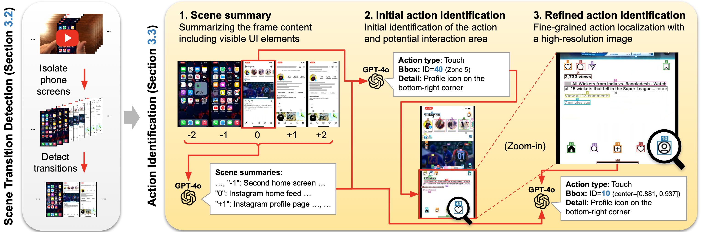

# Scalable Video-to-Dataset Generation for Cross-Platform Mobile Agents

<p align="center" style="font-size: small;">
  <b>Yunseok Jang*</b> · <b>Yeda Song*</b> · <b>Sungryull Sohn</b> · <b>Lajanugen Logeswaran</b> · <b>Tiange Luo</b> · <b>Dong-Ki Kim</b> · <b>Kyunghoon Bae</b> · <b>Honglak Lee</b>
  <br>
  University of Michigan · LG AI Research
</p>


<div align="center">

[](https://arxiv.org/abs/2505.12632)
[](https://github.com/runamu/monday)
[](https://huggingface.co/datasets/runamu/MONDAY)
[](https://monday-dataset.github.io)


</div>

## 🎉 News
- **2025.05.19**: Released the [MONDAY dataset](https://huggingface.co/datasets/runamu/MONDAY) with data processing code and an example evaluation script.
- **2025.04.19**: The paper was accepted to the [3rd MMFM Workshop](https://sites.google.com/view/mmfm3rdworkshop) on "What is Next in Multimodal Foundation Models?"
- **2025.02.26**: The paper was accepted to [CVPR 2025](https://cvpr.thecvf.com/Conferences/2025).

<div align="center">

## Contents
</div>

<div align="center" style="font-family: Arial, sans-serif;">
  <p>
    <a href="#-monday-overview" style="text-decoration: none;">📱 MONDAY Overview</a> ·
    <a href="#-environment-setup" style="text-decoration: none;">✨ Environment Setup</a> ·
    <a href="#-dataset-usage" style="text-decoration: none;">🚀 Dataset Usage</a> ·

  </p>
  <p>
    <a href="#-planned-updates" style="text-decoration: none;">🧭 Planned Updates</a> ·
    <a href="#-citation" style="text-decoration: none;">🎸 Citation</a> ·
    <a href="#-license" style="text-decoration: none;">📄 License</a>
  </p>
</div>


## 📱 MONDAY Overview

We present _MONDAY_ (Mobile OS Navigation Task Dataset for Agents from YouTube), a cross-platform mobile navigation dataset for training vision-language models. This dataset contains
- **20K** curated list of videos of mobile navigation tasks from YouTube, including Android and iOS devices.
- **333K** detected scenes, each representing a temporally segmented step within a mobile navigation task.
- **313K** identified actions, including touch, scroll, hardware, typing, long press, multi touch and zoom.

Please visit our [project page](https://monday-dataset.github.io/) for more details.

<p align="center">
  
</p>

<p align="center"><em>Figure: Core components of the MONDAY data collection framework, showing scene transition detection followed by a 3-step action identification process.</em></p>

## ✨ Environment Setup
### 1. Clone the repository
```bash
git clone https://github.com/runamu/monday.git
```
### 2. Create a conda environment and install dependencies
```bash
conda create -n monday python=3.10 -y
conda activate monday
pip install -r requirements.txt
pip install "jax[cpu]==0.4.13"
conda install -c conda-forge ffmpeg -y
```

## 🚀 Dataset Usage
### 1. Extract Scenes from Videos
To extract the scenes from the videos, you need to download the videos corresponding to the `video_id`'s in the MONDAY dataset from YouTube. The corresponding video URLs can be found in `data/video_urls/video_urls_{split}.txt`. For agent model evaluation, you only need to download the videos in the `test` and `test_unseen_os` splits.

Please put the downloaded videos in the `data/videos/` directory. The filenames should be in the format `{video_id}.mp4`.

Run the following command to extract the scenes from the videos. The extracted images will be saved in the `data/images/` directory.
```bash
python data_processing/extract_scenes.py --video_dir data/videos/ --output_dir data/images/
```

### 2. Convert the Data into JSON Format
To train and evaluate a vision-language model for mobile navigation, we combine the extracted scenes and annotations from the [MONDAY dataset](https://huggingface.co/datasets/runamu/MONDAY) and convert them into JSON format.

Run the following command to perform the conversion. The output will be saved in `data`. In this JSON file, we use the relative path of the images as the image path. The image path is relative to the `data/images/` directory.
```bash
python data_processing/convert_data_into_json.py --output_dir data
```

### 3. Evaluate a Vision-Language Model on MONDAY
We provide `agent_tasks/eval_seeclick.py` for evaluating Qwen-VL-based (e.g., SeeClick-like) models on the MONDAY dataset's test splits.
Below are example commands to evaluate [SeeClick-aitw](https://huggingface.co/cckevinn/SeeClick-aitw) on the MONDAY test splits.
(Note that we use our own AitW-finetuned version of SeeClick in our paper, which is different from SeeClick-aitw.)

To evaluate on the `test` split of MONDAY:
```bash
cd agent_tasks
XLA_PYTHON_CLIENT_PREALLOCATE=false CUDA_VISIBLE_DEVICES=0 python eval_seeclick.py \
  --model_path cckevinn/SeeClick-aitw \
  --imgs_dir ../data/images/ \
  --test_json_path ../data/ours_data_test.json \
  --log_root ./logs/ \
  --eval_name seeclick \
  --task monday
```

To evaluate on the `test_unseen_os` (Windows Mobile) split of MONDAY:
```bash
cd agent_tasks
XLA_PYTHON_CLIENT_PREALLOCATE=false CUDA_VISIBLE_DEVICES=0 python eval_seeclick.py \
  --model_path cckevinn/SeeClick-aitw \
  --imgs_dir ../data/images/ \
  --test_json_path ../data/ours_data_test_unseen_os.json \
  --log_root ./logs/ \
  --eval_name seeclick \
  --task windows_mobile
```

## 🧭 Planned Updates
- [ ] Release of the pretrained model checkpoints
- [ ] Release of the training scripts
- [ ] Release of the data pipeline code


## 🎸 Citation
If you find MONDAY helpful, please cite us.
```bibtex
@inproceedings{jang2025_monday,
    title={{Scalable Video-to-Dataset Generation for Cross-Platform Mobile Agents}},
    author={Jang, Yunseok and Song, Yeda and Sohn, Sungryull and Logeswaran, Lajanugen and Luo, Tiange and Kim, Dong-Ki and Bae, Kyunghoon and Lee, Honglak},
    booktitle={Proceedings of the IEEE/CVF Conference on Computer Vision and Pattern Recognition (CVPR)},
    year={2025}
}
```

## 📄 License

This project incorporates specific video contents, model checkpoints, datasets, and codes governed by their original licenses. Users are required to adhere to all terms of these licenses. No additional restrictions are imposed by this project beyond those specified in the original licenses.